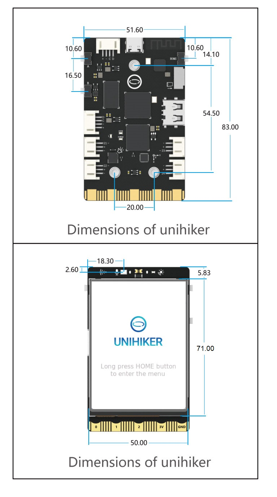

The key dimensions for the UNIHIKER are measured in millimeters (mm).

- Note 1: The back of the UNIHIKER features three M3 nuts that can be used to secure it to other objects, such as 3D printed parts, using M3 screws and nylon or hexagonal standoffs.
- Note 2: When creating a DIY enclosure for the UNIHIKER, it is crucial to leave space below the screen for cable routing to prevent any compression or damage.

