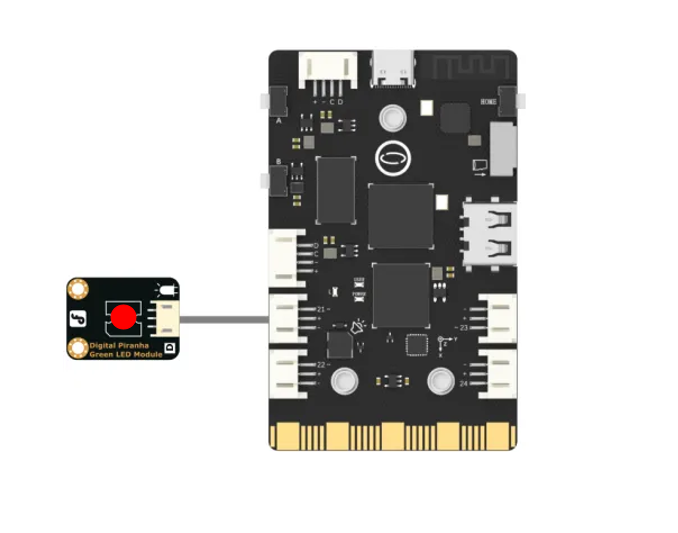

### **Description**
Control the specified IO pin to output high level (3.3V) or low level (0V).

### **Common functions**

The following two functions can achieve the same effect.


#### 1.1 Pin( )
| **Syntax**          | **PinObject = Pin(Pin.num, Pin.OUT)**         |  
| :--------------     | :--------------------      |
| **Description**     | Set the specified pin to OUT mode.       |  
| **Parameters**      | **Pin.num**: Pin number.                        |
|                                   |  **Pin.OUT**: OUT mode. |
| **Return**          | Pin object    |  


#### 1.2 write_digital( )
| **Syntax**          | **PinObject.write_digital(v)**   |  
| :--------------     | :--------------------      |
| **Description**     | Output digital level       |  
| **Parameters**      | **v**: 0 or 1, 1 indicates high-level output (3.3V), 0 indicates low-level output (0V).  |  
| **Return**          | **None   |  


#### 1.3 value( )
| **Syntax**          | **PinObject.value(v)**        |  
| :--------------     | :--------------------      |
| **Description**     | Output digital level.      |  
| **Parameters**      | **v**: 0 or 1, 1 indicates high-level output (3.3V), 0 indicates low-level output (0V).  |  
| **Return**          | **None    |  


### **Example Description**
Below is a sample code using the PinPong Library to control an LED and print corresponding messages when the LED is turned on or off. This code allows for the changes in the output level of GPIO pins to be felt through the on/off of LED lights.
### **Hardware Required**

- [UNIHIKER](https://www.dfrobot.com/product-2691.html)
- [Gravity: Digital Piranha LED Module - Red](https://www.dfrobot.com/product-471.html)


### **Example Code**
```python
# -*- coding: UTF-8 -*-

import time
from pinpong.board import Board, Pin

Board().begin() # Initialize the UNIHIKER

led = Pin(Pin.P21, Pin.OUT) # Set Pin P21 as an output pin for the LED

while True:
    # led.value(1)  # The second method
    led.write_digital(1) # Turn on the LED by setting the pin value to high
    print("The LED light is on") # Display a message indicating that the LED light is on 
    time.sleep(1)  # Pause the program for 1 second
    # led.value(0)  # The second method
    led.write_digital(0) # Turn off the LED by setting the pin value to low
    print("The LED light is off")  # Display a message indicating that the LED light is off
    time.sleep(1) # Pause the program for 1 second
```

### **Program Effect:**

![20240805_154353[00h00m00s-00h00m05s].gif](img/1_Digital_Output_GPIO_/1722843885000-ab87e462-fbf8-41c3-ad2d-afeee0e974a2.gif)


---
