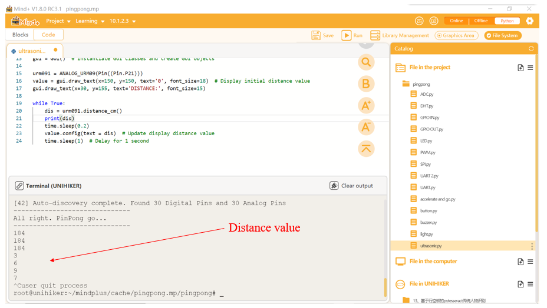

### **Description**
UNIHIKER is equipped with a microcontroller responsible for controlling onboard components and GPIO. Based on this functionality, we can control the external ultrasonic sensor by Pin21. This project uses PinPong library of Python to control the ultrasonic sensor externally connected through side pins of the board. The reason for using the ultrasonic module is that it can detect the distance between the object in front of itself through ultrasonic waves, thereby simulating the scene of obstacles and timely braking when the vehicle is moving forward.
### **Syntax**
**Object = ANALOG_URM09(Pin((Pin.P21)))**
**dis = Object.distance_cm()**
### **Parameters**
**Pin.P21:** Pin number 21.
### **Return**
**distance value**
### **Example Description**
In this example, UNIHIKER is first initialized with Board().begin(). We use urm091 = ANALOG_URM09(Pin((Pin.P21))) to initialize the pin. We use txt=gui.draw_text() to display the content we want to display on the screen. In the main loop, we use the dis = urm091.distance_cm() method to get the value of the distance.
### **Hardware Required**

- [UNIHIKER](https://www.dfrobot.com/product-2691.html)
- [Gravity: URM09 Ultrasonic Distance Sensor (2～500cm, Analog)](https://www.dfrobot.com/product-1862.html)


### **Example Code**
```python
#  -*- coding: UTF-8 -*-

# Experimental effect: Simulate a Vehicle distance monitor through an external ultrasonic sensor and GUI interface
# Wiring: Use a Windows or Linux computer to connect a UNIHIKER main control board, Pin21 connects the ultrasonic sensor
from pinpong.libs.dfrobot_analog_urm09 import ANALOG_URM09
from pinpong.extension.unihiker import *
from unihiker import GUI  # Import unihiker library
from pinpong.board import Board,Pin
import time


Board().begin()
gui = GUI()  # Instantiate GUI classes and create GUI objects

urm091 = ANALOG_URM09(Pin((Pin.P21)))
value = gui.draw_text(x=150, y=150, text='0', font_size=18)  # Display initial distance value
gui.draw_text(x=150, y=18, text='0', font_size=18)

while True:
    dis = urm091.distance_cm()
    time.sleep(0.2)
    value.config(text = dis)  # Update display distance value
    time.sleep(1)  # Delay for 1 second
```
**Program Effect:**




---
