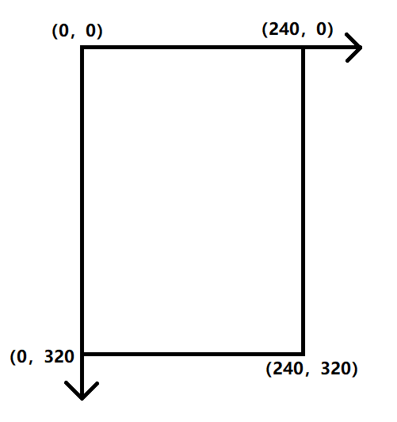
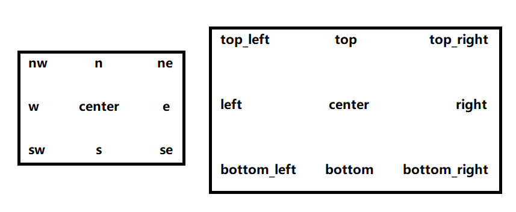
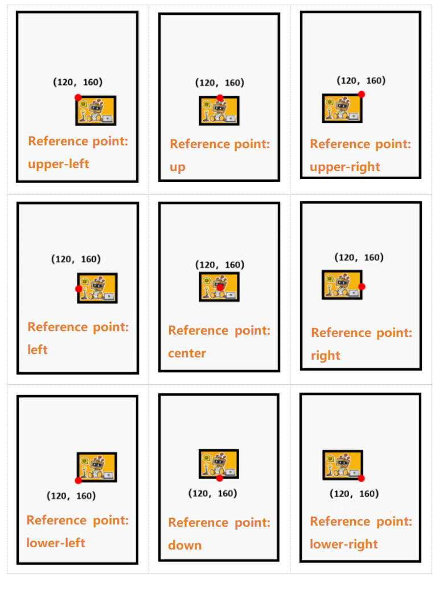
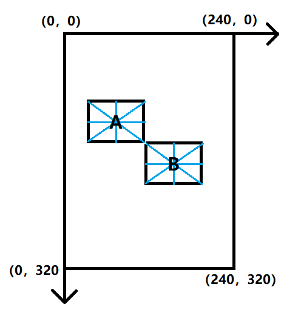

## **Coordinates on UNIHIKER Screen**
The resolution of the UNIHIKER screen is 240 x 320, which means the width of the board is 240 pixels and the height is 320 pixels. We use a coordinate system to describe the position on the screen: the origin is the top-left corner of the screen, the positive x-axis points to the right, and the positive y-axis goes down. So we can set the coordinates of x and y in the codes to make texts and other elements on the screen be displayed at the specific location.




## **Reference Point of the UNIHIKER (Origin)**
The UNIHIKER sets a total of 9 reference points, namely **top,bottom, left, right, center, top_left, bottom_left, top_right, and bottom_right(n,s,w,e,center,nw,sw,ne,se)**. 

> **Note:** Location points can be identified using two methods: cardinal directions (ESWN - East, South, West, North) and spatial directions (top, bottom, left, right).

| Orientation            | Method 1: Cardinal Directions (ESWN) | Method 2: Relative Directions (top/bottom/left/right) |
| ---------------------- | ------------------------------------ | ----------------------------------------------------- |
| top/north              | n                                    | top                                                   |
| bottom/south           | s                                    | bottom                                                |
| left / west            | w                                    | left                                                  |
| Right / East           | e                                    | right                                                 |
| top left/northwest     | nw                                   | top_left                                              |
| top right/northeast    | ne                                   | top_right                                             |
| bottom left/southwest  | sw                                   | bottom_left                                           |
| bottom right/southeast | se                                   | bottom_right                                          |
| center                 | center                               | center                                                |

**Diagram:**



Thus, to display an image at the center of the UNIHIKER screen, represented by a red dot with coordinates (120, 160) in the figure below, we have 9 possible options.




**Sample Effects：**
When object A and object B have the same x and y coordinates, set the reference point of object A to the bottom right corner and the reference point of object B to the top left corner. The final display effect is as follows:



> Note: The parameter mentioned above is only applicable to certain objects.

## Update Widget(config)

**Syntax:** ```object_name.config(parameter_name_to_update=value)```

- **Return :** None
- **Input :** parameter_name_to_update=value
- **Usage Example:** ```info_text.config(text="mouse:x=0,y=0")```


## Remove Widget(remove)

**Syntax:**```object_name.remove()```

- **Return:** None
- **Input:** None
- **Usage Example：** ```info_text.remove()```

> Note 1: Once an object is deleted, config operations cannot be performed on it, and it needs to be re-created. If you only want to temporarily hide an object and not display it on the screen, it is recommended to use config to set the xy coordinates of the object off the screen. 
>
> Note 2: Starting from version 0.0.22, the recommended method to delete an object in the unihiker library is: 
>
> **Syntax:** ```GUI.remove(object_name)```
- **Return:** None

- **Input:** None

- **Usage Example：** ```gui.remove(info_text)```

  

## Remove All Widgets(clear)

**Syntax:**```GUI.clear()```

- **Return:** None
- **Input:** None
- **Usage Example:** ```gui.clear()```
> Note: Once an object is deleted, config operations cannot be performed on it, and it needs to be re-created. If you only want to temporarily hide an object and not display it on the screen, it is recommended to use config to set the xy coordinates of the object off the screen.   

## Color(color)
There are three methods to represent colors:
- RGB: color = (255,0,0)  
- Hexadecimal values: color = "#ff00ff"  
- Fixed color：color = "red"  
