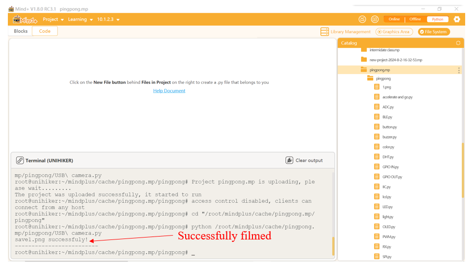
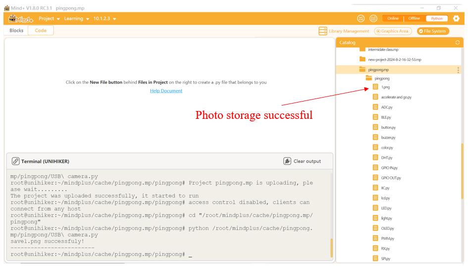
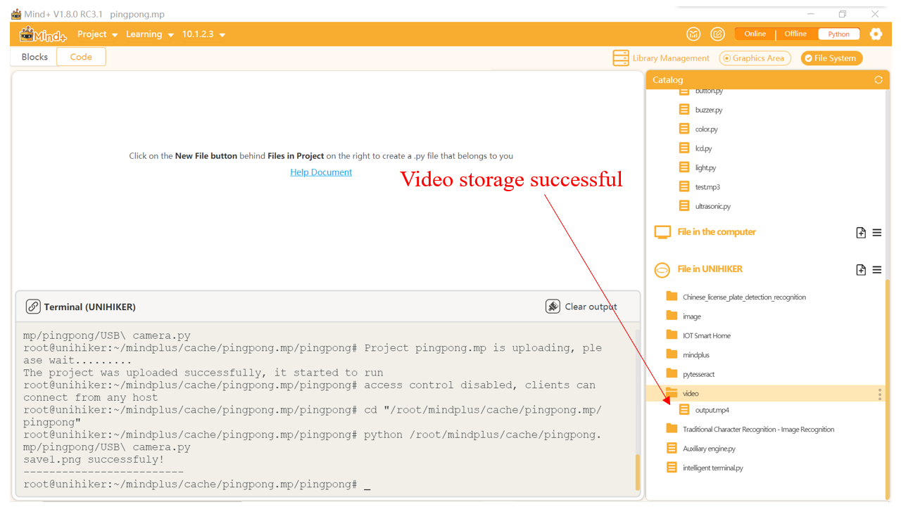

## Description
The UNIHIKER is equipped with a standard USB interface, so it can connect to an external USB camera to capture image data.

To control a USB camera with UNIHIKER, the OpenCV library in Python is commonly used.

This section will introduce the common functions and usage effects of using the OpenCV library to call a USB camera.

## Common functions(OpenCV Library)

#### 1.1 cv2.VideoCapture( )
| **Syntax**          | **Object = cv2.VideoCapture(num)**      |   
| :--------------     | :--------------------      |
| **Description**     | Open the media.      |  
| **Parameters**      | **num:** The number of the camera.  |  
| **Return**          | **None    |  


#### 1.2 cv2.set( )
| **Syntax**          | **Object.set(cv2.CAP_PROP_BUFFERSIZE, value)**     |   
| :--------------     | :--------------------      |
| **Description**     | Camera parameter settings.      |  
| **Parameters**      | **cv2.CAP_PROP_BUFFERSIZE:** Set maximum buffer size.  |  
|                     | **value:** buffer size.                |                               
| **Return**          | **None    |  


#### 1.3 cv2.namedWindow( )
| **Syntax**          | **cv2.namedWindow('winname',cv2.WND_PROP_FULLSCREEN)**     |   
| :--------------     | :--------------------      |
| **Description**     | Camera window naming.      |  
| **Parameters**      | **'winname':** The name of the window.  |  
|                     | **cv2.WND_PROP_FULLSCREEN:** Full screen display.           |                               
| **Return**          | **None    |  


#### 1.4 cv2.setWindowProperty( )
| **Syntax**          | **cv2.setWindowProperty('winname',cv2.WND_PROP_FULLSCREEN, cv2.WINDOW_FULLSCREEN)**     |   
| :--------------     | :--------------------      |
| **Description**     | Camera parameter settings.      |  
| **Parameters**      | **'winname':** The name of the window.  |  
|                     | **cv2.WND_PROP_FULLSCREEN:** Full screen display.     |    
|                     | **cv2.WINDOW_FULLSCREEN:** Full screen display.   |                   
| **Return**          | **None    |  


#### 1.5 isOpened( )
| **Syntax**          | **while(Object.isOpened())**     |   
| :--------------     | :--------------------      |
| **Description**     | Verify if the opening is successful.       |  
| **Parameters**      | **None  |                  
| **Return**          | True or False    |  


#### 1.6 cap.read( )
| **Syntax**          | **ret, frame = cap.read()**     |   
| :--------------     | :--------------------      |
| **Description**     | Read a frame of the image.       |  
| **Parameters**      | **ret:** Read the successful identifier. |      
|                     | **frame:** One frame of image.         |  
| **Return**          | Identification bit and single frame image.    |  


#### 1.7 cv2.imshow( )
| **Syntax**          | **cv2.imshow('winname',frame)**     |   
| :--------------     | :--------------------      |
| **Description**     | Display the image in a window.       |  
| **Parameters**      | **'winname':** Window Name. |      
|                     | **frame:** Single frame image.         |  
| **Return**          | **None    |  


#### 1.8 cv2.resize( )
| **Syntax**          | **frame = cv2.resize(frame, (240, 320))**     |   
| :--------------     | :--------------------      |
| **Description**     | Crop the frame to UNIHIKER screen size.      |  
| **Parameters**      | **frame:** Single frame image. |      
|                     | **240, 320:** width and length.        |  
| **Return**          | The cropped video frame.   |  


#### 1.9 cv2.flip( )
| **Syntax**          | **frame = cv2.flip(frame,1)**     |   
| :--------------     | :--------------------      |
| **Description**     | Rotate the image 180°.      |  
| **Parameters**      | **frame:** Single frame image. |      
|                     | **1:** It can be changed to 0 to alter the flipping form.      |  
| **Return**          | Flip the screen 180 degrees.   |  


#### 1.10 cv2.waitKey( )
| **Syntax**          | **key = cv2.waitKey(delay)**     |   
| :--------------     | :--------------------      |
| **Description**     | Detect if a key is pressed.      |  
| **Parameters**      | **none      |  
| **Return**          | The ASCII code value of the pressed key or the value of a special key. If no key is pressed, it returns -1.   |  


#### 1.11 cv2.rotate( )
| **Syntax**          | **frame = cv2.rotate(frame, cv2.ROTATE_90_COUNTERCLOCKWISE)**     |   
| :--------------     | :--------------------      |
| **Description**     | Rotate the screen 90 degrees.     |  
| **Parameters**      | **frame:** Single frame image.     |  
|                     | **cv2.ROTATE_90_COUNTERCLOCKWISE:** Default parameter, rotate 90 °. |
| **Return**          | The rotated image.  |  


#### 1.12 cv2.imwrite( )
| **Syntax**          | **cv2.imwrite(str(index) + ".png", frame)**     |   
| :--------------     | :--------------------      |
| **Description**     | Store a frame of image according to the path.     |  
| **Parameters**      | **str(index):** Image number.    |  
|                     | **".png":** Register number. |
|                     | **frame:** Single frame image.   |
| **Return**          | Picture  |  


#### 1.13 cv2.VideoWriter_fourcc( )
| **Syntax**          | **fourcc = cv2.VideoWriter_fourcc(*'mp4v')**     |   
| :--------------     | :--------------------      |
|                     | **Object= cv2.VideoWriter('/root/video/output.mp4',fourcc,3,(240,320))** |
|                     | **Object.write(frame)**  |
| **Description**     | Record a video.     |  
| **Parameters**      | **'/root/video/output.mp4':** Save the path of the video.   |  
|                     | **fourcc:** Video format.|
|                     | **data:** Write data.  |
|                     | **value:** The frame rate of the video.   |
| **Return**          | Video  |  


#### 1.14 release( )
| **Syntax**          | **cap.release()**     |   
| :--------------     | :--------------------      |
| **Description**     | Close OpenCV     |  
| **Parameters**      | **None   |  
| **Return**          | **None  |  


#### 1.15 cv2.destroyAllWindows( )
| **Syntax**          | **cv2.destroyAllWindows()**     |   
| :--------------     | :--------------------      |
| **Description**     | Close the windows     |  
| **Parameters**      | **None   |  
| **Return**          | **None  |  


## Example Description
The following code implements the common functions of using a camera on UNIHIKER.
The generated video after running is in a state where it is horizontally flipped 180 ° and rotated 90 ° to the right relative to the normal video.

## Hardware Required

- [UNIHIKER](https://www.dfrobot.com/product-2691.html)
- [MegaPixels USB Camera for Raspberry Pi / NVIDIA Jetson Nano / UNIHIKER](https://www.dfrobot.com/product-2089.html)


## Example Code

```python
#  -*- coding: UTF-8 -*-
import cv2  # Import OpenCV library


# Open usb camera 0.
cap = cv2.VideoCapture(0) 
# Set the camera buffer to 1, to decrease the latency.
cap.set(cv2.CAP_PROP_BUFFERSIZE, 1) 
# Set the windows to be full screen.
cv2.namedWindow('winname',cv2.WND_PROP_FULLSCREEN) 
# Set the windows to be full screen.
cv2.setWindowProperty('winname',cv2.WND_PROP_FULLSCREEN, cv2.WINDOW_FULLSCREEN) 

index = 1
fourcc = cv2.VideoWriter_fourcc(*'mp4v')

while (cap.isOpened()): 
    # Read one frame from usbcam.
    ret, frame = cap.read() 
    # If frame available. 
    if ret: 
        '''crop the center of the frame and resize to (240, 320) while keeping image ratio.'''
        h, w, c = frame.shape  # Record the shape and size of the image, including height, width, and channel
        w1 = h*240//320  # change the height to fit the render image
        x1 = (w-w1)//2  # midpoint of width without resizing
        frame = frame[:, x1:x1+w1]  # crop into the center
        frame = cv2.resize(frame, (240, 320))  # resize according to the screen keeping the aspect ratio 
        frame = cv2.flip(frame,1)  # Rotate horizontally 180 °
        frame = cv2.rotate(frame, cv2.ROTATE_90_COUNTERCLOCKWISE)
        '''Display real-time video stream'''
        cv2.imshow('winname',frame)  # Display image img on winname window
        key = cv2.waitKey(1)  # Refresh the image every 1ms, and the delay cannot be 0, otherwise the read result will be a static frame
        if key & 0xFF == ord('a'):  # Press the A key to enter the save image operation below
            cv2.imwrite(str(index) + ".png", frame)
            print("save" + str(index) + ".png successfuly!")
            print("-------------------------")
            index += 1
            # lz = cv2.VideoWriter('/root/video/output.mp4',fourcc,3,(240,320))  # Store video recordings
            # lz.write(frame)  # Storage frame
            # cv2.imshow('cvNamedWindow',frame)  # Display video stream
        '''Press the B key to exit the program'''
        if key & 0xFF == ord('b'):
            break

cap.release()  # Release the camera
cv2.destroyAllWindows()  # Close all
```
## **Program Effect:**
Firstly, turn on the camera and the video stream will be displayed on UNIHIKER. Press the 'b' key to exit.
![20240813_150015[00h00m00s-00h00m06s].gif](img/1_USB_Carema/1723532458106-358f3a33-1c2f-4750-a05d-0912d3661a82.gif)
Press the 'a' key to take a picture with the camera.


Replace the code after pressing the 'a' key in the comments to complete the recording and storage of the video.

