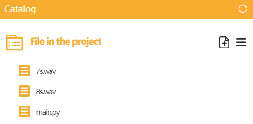

# Introduction
The UNIHIKER is equipped with a buzzer rather than a speaker, so it cannot play audio. To play audio, you need to connect a USB speaker to the USB interface or connect to a Bluetooth speaker.
This chapter introduces two commonly used audio control libraries.


## 1.Control USB Speaker to play audio through UNIHIKER's unique Audio library
### Description
Through this example, we can learn how to control USB speakers to play audio using Python libraries. The Audio library is a specially packaged Python library on UNIHIKER that provides various functions for playing audio.
### Common functions(UNIHIKER Audio Library)


#### 1.1 play( )
| **Syntax**          | **Audio.play(file)**     |   
| :--------------     | :--------------------      |
| **Description**     | Playing music with the external USB speaker on UNIHIKER.     |  
| **Parameters**      | **file**: File name to be played. It can be in different audio formats such as WAV, MP3, etc.  |  
| **Return**          | **None  |  


#### 1.2 start_play()
| **Syntax**          | **Audio.start_play(file)**     |   
| :--------------     | :--------------------      |
| **Description**     | Begin to play the music with external USB speaker on UNIHIKER.    |  
| **Parameters**      | **file**: File name to be played. It can be in different audio formats such as WAV, MP3, etc.  |  
| **Return**          | **None  |  


#### 1.3 pause_play()
| **Syntax**          | **Audio.pause_play()**     |   
| :--------------     | :--------------------      |
| **Description**     | Pause the music when it is playing with the external USB speaker on UNIHIKER.     |  
| **Parameters**      | **None  |  
| **Return**          | **None  |  


#### 1.4 resume_play( )
| **Syntax**          | **Audio.resume_play()**    |   
| :--------------     | :--------------------      |
| **Description**     | Resume the paused music.    |  
| **Parameters**      | **None  |  
| **Return**          | **None  |  


#### 1.5 stop_play()
| **Syntax**          | **Audio.stop_play()**     |   
| :--------------     | :--------------------      |
| **Description**     | Stop the playing music.     |  
| **Parameters**      | **None  |  
| **Return**          | **None  |  


Tips: For more common functions, please refer to Section 2 of Audio Class.  


### Example Description
In this simple example, we'll start by playing a 7-second music track through the external USB speaker on UNIHIKER. Once the playback finishes, we'll automatically start playing an 8-second music track and then retrieve the remaining playback time twice. Following this, the music playback will pause automatically, resume after a few seconds, and finally stop playing altogether.
Tips: For more code details, please refer to Section 2 of Audio Class.
### Hardware Required

- [UNIHIKER](https://www.dfrobot.com/product-2691.html)
- USB speaker


### Example Code
```python
from unihiker import Audio  # Import the Audio module from the unihiker package
import time

audio = Audio()  # Instantiate the Audio class

print("Playing 7s Audio")
audio.play('7s.wav')  # Play the audio file '3s.wav'
print("Playback Completed")

print("Start Playing 8s Audio")
audio.start_play('8s.wav')  # Start playing the audio file '6s.mp3' in the background

for i in range(2):
    remain_time = audio.play_time_remain()  # Get the remaining time of the audio playback
    print("Remaining Time: " + str(remain_time))
    time.sleep(1)  # Pause for 1 second

print("Pause Playback")
audio.pause_play()  # Pause the audio playback
for i in range(2):
    remain_time = audio.play_time_remain()
    print("Remaining Time: " + str(remain_time))
    time.sleep(1)

print("Resume Playback")
audio.resume_play()  # Resume the paused audio playback
for i in range(2):
    remain_time = audio.play_time_remain()
    print("Remaining Time: " + str(remain_time))
    time.sleep(1)

print("Stop Playback")
audio.stop_play()  # Stop the audio playback
print("Playback Ended")
```
**Program Effect:**
Note: The file should be located within the same directory as this code.

The speaker commences playing music in accordance with the established settings, concurrently presenting the pertinent status on the terminal.
  


## **2.Using the Python library pyttsx3 for speech synthesis to control USB audio playback**
### Description
To control a USB speaker using the UNIHIKER, we can use onboard USB interface. This will allow us to access and control the audio through the side interface of the board, which is connected to a microcontroller responsible for controlling onboard components and GPIO.
To control the audio, we can use the methods from the pyttsx3 library in Python. This will allow us to Control the synthesis of audio and play it according to the user's wishes through parameter settings. You can explore different functionalities and parameters of the pyttsx3 library to customize your DIY Speech Synthesis Assistant.
### Common functions(pyttsx3 Library)


#### 2.1 pyttsx3.init( )
| **Syntax**          | **Object = pyttsx3.init()**    |   
| :--------------     | :--------------------      |
| **Description**     | Initialize pyttsx3.    |  
| **Parameters**      | **None  |  
| **Return**          | **None  |  


#### 2.2 setProperty( )
| **Syntax**          | **Object.setProperty('volume',value)**    |   
| :--------------     | :--------------------      |
| **Description**     | Set the pronunciation volume (within the range of 0-1).   |  
| **Parameters**      | **'volume':** Attribute: Sound.  |  
|                     | **value:** Range of sound size: 0-1.  |
| **Return**          | The value of sound.  |  


#### 2.3 Object.setProperty( )
| **Syntax**          | **Object.setProperty('rate',value)**    |   
| :--------------     | :--------------------      |
| **Description**     | Set the reading speed.   |  
| **Parameters**      | **rate:** Attribute: Rate.  |  
|                     | **value:** Range of rate size: 0-200.  |
| **Return**          | The value of rate.   |  


#### 2.4 Object.say( )
| **Syntax**          | **Object.say("hello, i am unihiker")**    |   
| :--------------     | :--------------------      |
| **Description**     | Read the content aloud in English.    |  
| **Parameters**      | **"text":**The statement that the user wants the USB speaker to play.  |  
| **Return**          | **None  |  


#### 2.5 save_to_file( )
| **Syntax**          | **Object.save_to_file("hello, i am unihiker", "test.mp3")**    |   
| :--------------     | :--------------------      |
| **Description**     | Save the content as audio (named test. mp3).    |  
| **Parameters**      | **"text":** The statement that the user wants the USB speaker to play. |  
|                     | **"file name":** File name.   |
| **Return**          | The file "test.mp3".  |  


#### 2.6 runAndWait( )
| **Syntax**          | **Object.runAndWait()**    |   
| :--------------     | :--------------------      |
| **Description**     | Run the TTS engine and wait for the reading to complete.   |  
| **Parameters**      | **None  |  
| **Return**          | **None  |  


### Example Description
To create a DIY speech synthesis assistant, we can use the pyttsx3 library in Python. First, import pyttsx3 and use engine = pyttsx3.init() to initialize the audio output function. Then, we can use engine.setProperty() to set the volume and speed of audio output. To input text, we can use engine.say() and the Python library will automatically recognize the language and play it. To save the audio output, we can use the function engine.save(). You can experiment with different parameters and functions to customize your DIY Speech Synthesis Assistant project further.
### Hardware Required

- [UNIHIKER](https://www.dfrobot.com/product-2691.html)
- USB speaker


**Example Code**
```python
'''Voice Play Text'''
import pyttsx3  # Import pyttsx3 library
engine = pyttsx3.init()  # Initialize TTS engine and create engine objects
engine.setProperty('volume',1)  # Set the pronunciation volume (within the range of 0-1)
engine.setProperty('rate',120)  # Set the reading speed (within the range of 0-200)
engine.say("hello, i am unihiker")  # Read the content aloud in English
engine.save_to_file("hello, i am unihiker", "test.mp3")  # Save the content as audio (named test. mp3)
engine.runAndWait()  # Run the TTS engine and wait for the reading to complete
```
**Program Effect:**


