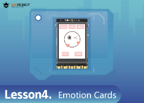
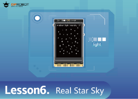
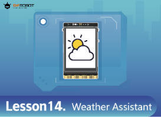

# UNIHIKER Graphical Python Tutorial for Beginners
 
This is a set of zero-based tutorials, using Mind+ graphical programming to learn the use of unihiker.
   
  

|   |  |  | 
| :------------: | :------------: | :------------: |
|   [Hello, UNIHIKER!](https://edu.dfrobot.com/makelog-308760.html "Hello, UNIHIKER!")   |  [Travel Signpost](https://edu.dfrobot.com/makelog-308761.html "Travel Signpost")   | [Journey to the West Stage Play](https://edu.dfrobot.com/makelog-308765.html "Journey to the West Stage Play")   | 
|   |  | | 
| [Emotion Cards](https://edu.dfrobot.com/makelog-308766.html "Emotion Cards")  | [Escape Game](https://edu.dfrobot.com/makelog-308767.html "Escape Game") |[Real Starry Sky](https://edu.dfrobot.com/makelog-308768.html "Real Starry Sky")  |
|   |  |  |
|[Interactive Art Museum](https://edu.dfrobot.com/makelog-308769.html "Interactive Art Museum")  | [Smart Piano](https://edu.dfrobot.com/makelog-308770.html "Smart Piano") | [Workout Attendance Tracker](https://edu.dfrobot.com/makelog-308771.html "Workout Attendance Tracker") |
| |   |  |
|[Spirometer](https://edu.dfrobot.com/makelog-308772.html "Spirometer")  |[IoT Data Assistant](https://edu.dfrobot.com/makelog-308773.html "IoT Data Assistant")  | [Vital Capacity Data Visualization](https://edu.dfrobot.com/makelog-308775.html "Vital Capacity Data Visualization") |
|  | |  |
|  [Interactive IoT Classroom Quiz System](https://edu.dfrobot.com/makelog-308777.html "Interactive IoT Classroom Quiz System")|  [Weather Assistant](https://edu.dfrobot.com/makelog-308776.html "Weather Assistant")|  |
|updating...  |  |  |  | 

