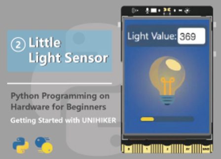
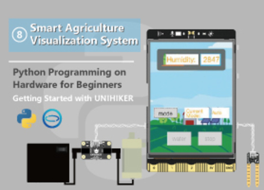
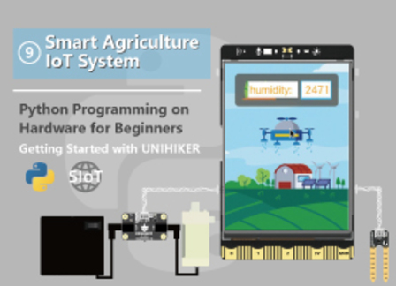
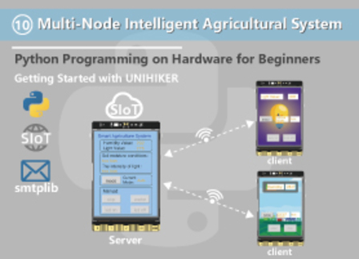

# Python Programming on Hardware for Beginners
This tutorial series uses Python code to control the Unihiker, implementing multiple interesting projects, making it easy for beginners to quickly get started with using the Unihiker.

|   |   |   |
| :------------: | :------------: | :------------: |
| [01 Introduction to the UNIHIKER](https://edu.dfrobot.com/makelog-313293.html "01 Introduction to the UNIHIKER")  |  [02 Little Light Catcher](https://edu.dfrobot.com/makelog-313294.html "02 Little Light Catcher") | [03 Multifunctional Reminder ](https://edu.dfrobot.com/makelog-313297.html "03 Multifunctional Reminder ")  |
|   |   |   |
|   |   |   |
|  [04 Simulating a Starry Sky](https://edu.dfrobot.com/makelog-313298.html "04 Simulating a Starry Sky") | [05 2D Maze](https://edu.dfrobot.com/makelog-313303.html "05 2D Maze")  |  [06 Snake Game](https://edu.dfrobot.com/makelog-313305.html "06 Snake Game") |
|   |   |   |
|   |   |   |
| [07 Schulte Grid Game](https://edu.dfrobot.com/makelog-313312.html "07 Schulte Grid Game")  | [08 Smart Agriculture Visualization System](https://edu.dfrobot.com/makelog-313313.html "08 Smart Agriculture Visualization System")  | [09 Smart Agriculture IoT System](https://edu.dfrobot.com/makelog-313314.html "09 Smart Agriculture IoT System")  |
|   |   |   |
|   |   |   |
|  [10 Multi-Node Intelligent Agricultural System](https://edu.dfrobot.com/makelog-313318.html "10 Multi-Node Intelligent Agricultural System") |   |   |
| updating...  |   |   |
