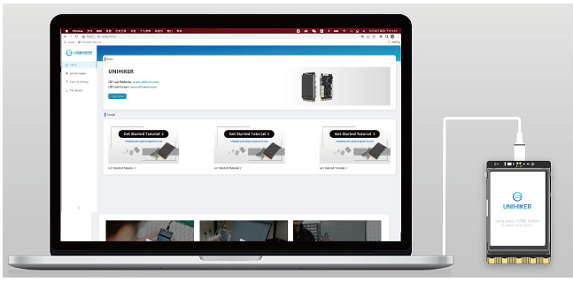
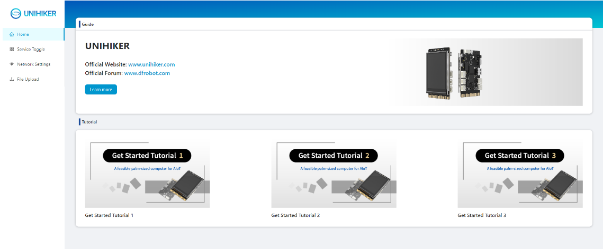
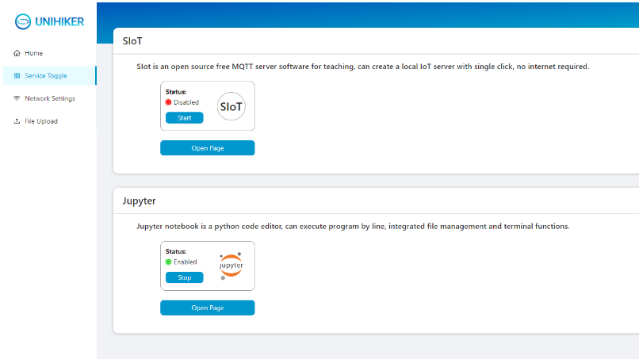
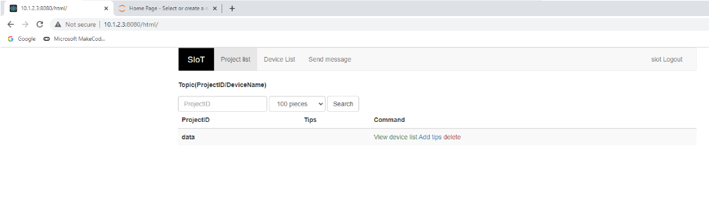
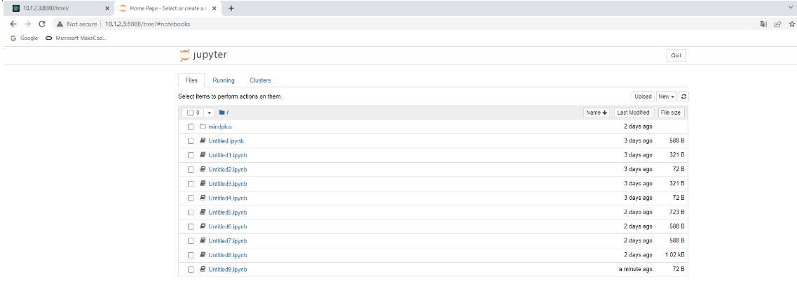
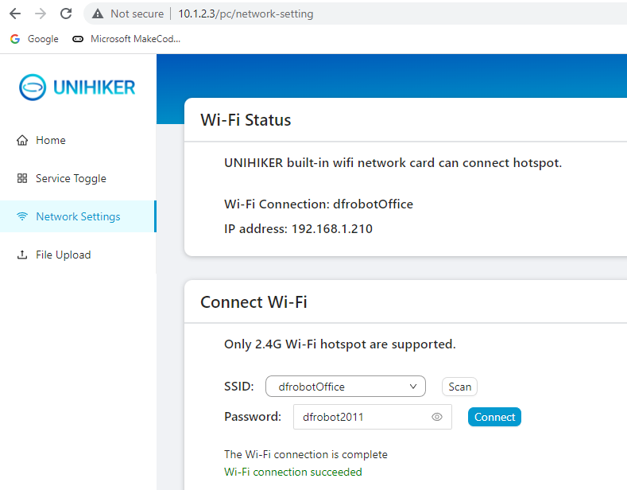
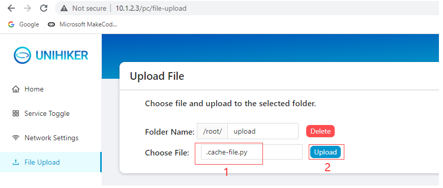

The UNIHIKER runs a local web page service(port:80), allowing you to access it directly from other devices. To do so, make sure that the device you are using (such as a computer, phone, or tablet) is on the same network as the UNIHIKER board (wired, wireless, or hotspot mode). Then, open the browser on the device and enter the UNIHIKER's IP address to access the webpage.
When the UNIHIKER is connected to your computer via a USB cable, you can easily open Chrome and enter the UNIHIKER IP (10.1.2.3) to access the local webpage.  

!!! note
     If you encounter a connection error, please check if the USB cable is connected correctly or refer to our FAQ for a solution. If the error persists, please join our UNIHIKER channel for assistance.
  
You will see the webpage interface as shown in the image.
## **Home Page**
This page provides tutorials on how to use the UNIHIKER board and offers easy access to the official website, tutorials, and forums to learn more about UNIHIKER.  
  

## **Service Toggle**
This page displays the running status of applications with backend management pages, such as SIoT and Jupyter. From here, you can turn the services on and off, or click on "Open Page" to access the corresponding service management page.

SIoT is a lightweight local MQTT server that communicates using the standard MQTT protocol and uses the SQLite database for local storage of received data. In Python, you can use the siot or paho library for communication.

!!! note
     Username: siot  
     Password: dfrobot  
     MQTT communication port: 1883  
     WEB data viewing page port: 8080  

## **Network Settings**
When entering the network settings page, the board will automatically scan for WiFi networks in the surrounding area. Select the desired WiFi network from the Name drop-down list and enter the password in the Password input box. Click "Connect" to connect the UNIHIKER to the WiFi network.
Note: If the connection fails, try connecting multiple times or double check that the password is entered correctly.
Note: Please note that currently, special symbol WiFi network names are not supported. Please change the WiFi name to one consisting of only letters and numbers. Additionally, the hotspot only supports 2.4G WiFi. If there is an option for mobile hotspot, please turn on 2.4G or activate compatibility mode.

## **File Upload**
This page allows you to upload files from your computer to the UNIHIKER through the web interface, which is useful for adapting software that cannot be directly connected to the UNIHIKER via ssh. Simply select the file and click "Upload" to transfer it to the specified folder. If there is a file with the same name, it will be overwritten. Please note that deleting a folder will also delete all files within it.
Note: Please note that only one file can be uploaded at a time on this page. For downloading or managing multiple files, we recommend using the SMB Service.

  

---  

