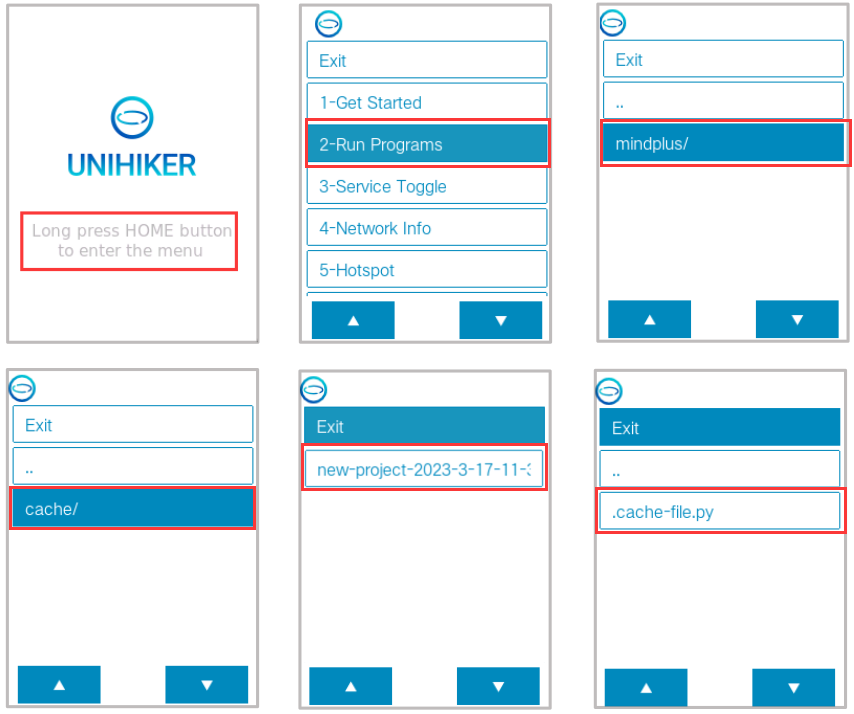

| **Q** | **How can I get the Mind+ graphical program to run on the UNIHIKER after disconnecting it from my computer?** |
| --- | --- |
| A | When you click on **Run** in Mind+, Mind+ will upload the generated Python codes when coding in block mode (including all contents in the **File in the project**) to the **mindplus** folder (named after the file name displayed in the top bar on Mind+) **in the UNIHIKER**. So you can find the corresponding project in the **mindplus** folder in the UNIHIKER's **Home menu**. The **.cache_file.py** is the program generated from the blocks. |
| |  |

