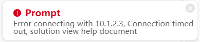
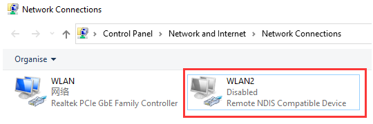
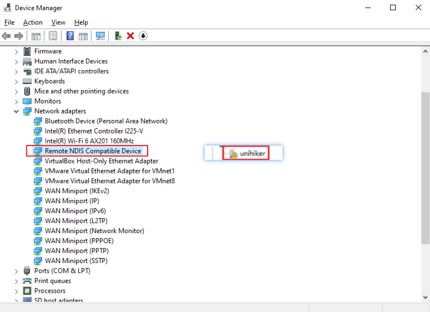

| **Q** | **Why Mind+ cannot connect to 10.1.2.3 after I connect the UNIHIKER to my PC via USB and the UNIHIKER logo appears?**{width=500} |
| --- | --- |
| A | **1.** First, open the **Network Connections** to check if there is an **enabled unrecognized Remote NDIS network**. If it shows **Disabled** or does not exist, **check if the USB cable is directly plugged into the computer's USB port without using any extension cables or docking station connectors**. |
| | 2. **If the wiring is correct and the UNIHIKER has done booting, open the Device Manager to check** if there is an unknown device named "unihiker" with a yellow exclamation mark. **If so, it means that the current system lacks the relevant driver and you need to install it manually.** Installation method: |
| | **a.** [[Download the driver package]](https://img.dfrobot.com.cn/wiki/none/3bea578f7062b725bbde9f383d8fbb16.zip)and unzip it to the desktop. |
| | **b.** Double-click on "unihiker" in the Device Manager, click **Update driver**, select **Browse my computer for driver software**, click **Browse**, and select the driver package folder that is downloaded and unzipped to the desktop. Then click **Next**, at this time a prompt may appear, just click **Install this driver software anyway**, and wait for the installation to complete. When the prompt **Windows has successfully updated your driver software** appears, it indicates that the installation was successful. |
| | **c.** Replug the UNIHIKER, and you will see an **RNDIS device** under **Network Adapters** in the Device Manager after the UNIHIKER is rebooted. When you open the **Network Connections**, you will see an **RNDIS** device. At this point, you can access 10.1.2.3 normally. If the connection still fails, please let us know. |

| **Q** | **What should I do if I cannot open the UNIHIKER Local Webpage on my browser or if it gets blocked?** |
| --- | --- |
| A | Check the browser kernel mode, select **Chromium mode**, or try it on the Chrome browser.If the network in the computer room is shut down, you need to add the website address `10.1.2.3:80` to the white list. |

