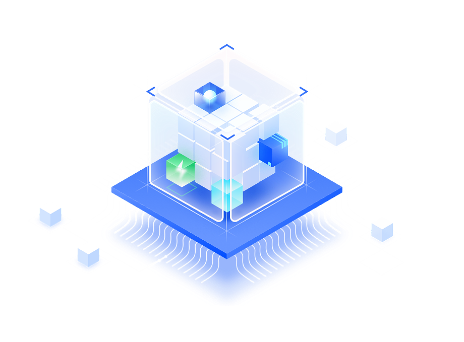

# **Welcome to UNIHIKER Documentation**
Unleash your imagination and embark on a new journey with UNIHIKER.
   

-   :material-format-list-group: &nbsp; __[Getting Started][start]__  
      Essential for Beginners
    &nbsp;__[{width=230, style="display:block;margin: 0 auto"}][start]__

    __&nbsp;[Jupyter Notebook][jupyter] |&nbsp; [Mind+][mind+] |&nbsp; [VS Code][vscode] |&nbsp;  [Python IDLE][python] |&nbsp; [Terminal Tool][ssh] |&nbsp; [Thonny][thonny]__  

-   :material-file-tree: &nbsp; __[Examples][examples]__  
      Get Started Quickly Through Projects
    &nbsp;__[{width=198, style="display:block;margin: 0 auto"}][examples]__  

    __&nbsp;[Python Coding][python-coding] | Graphical Coding__

-   :material-folder-open: &nbsp; __[Language Reference][unihiker-libraries]__  
      Software Library and API Documentation
    &nbsp;__[{width=200, style="display:block;margin: 0 auto"}][unihiker-libraries]__    

    __&nbsp;[UNIHIKER Libraries][unihiker-libraries] | Pinpong Libraries | USB Device__

-   :material-information: &nbsp; __[Hardware Reference][hardware]__  
      Hardware-Related Information
    &nbsp;__[{width=258, style="display:block;margin: 0 auto"}][hardware]__  

    __&nbsp;[Components][components] |&nbsp; [System Framework][system-framework] |&nbsp; [Specification][specification] |&nbsp;  [Overview][overview] |&nbsp; [Dimension][dimension] |&nbsp; [SVG & 3D File][3dfile]__

  [start]: wiki/get-started.md
  [examples]: wiki/Examples/PythonCodingExamples/BasicExamples/examples_py_hellounihiker.md
  [hardware]: wiki/HardwareReference/hardware_reference_introduction.md
  [jupyter]: wiki/GettingStarted/gettingstarted_jupyternotebook.md
  [mind+]: wiki/GettingStarted/gettingstarted_mind+.md
  [python]: wiki/GettingStarted/gettingstarted_python_idle.md
  [thonny]: wiki/GettingStarted/gettingstarted_thonny.md
  [ssh]: wiki/GettingStarted/gettingstarted_ssh.md
  [vscode]: wiki/GettingStarted/gettingstarted_vscode.md

  [python-coding]: wiki/Examples/PythonCodingExamples/BasicExamples/examples_py_hellounihiker.md

  [unihiker-libraries]: wiki/LanguageReference/Part1UNIHIKER/ScreenDisplay/reference_unihiker_draw_text.md

  [components]: wiki/HardwareReference/hardware_reference_onboard_components.md
  [system-framework]: wiki/HardwareReference/hardware_reference_unihiker_system_framework.md
  [specification]: wiki/HardwareReference/hardware_reference_specification.md
  [overview]: wiki/HardwareReference/hardware_reference_board_overview.md
  [dimension]: wiki/HardwareReference/hardware_reference_dimension.md
  [3dfile]: wiki/HardwareReference/hardware_reference_svg_3d_file.md

