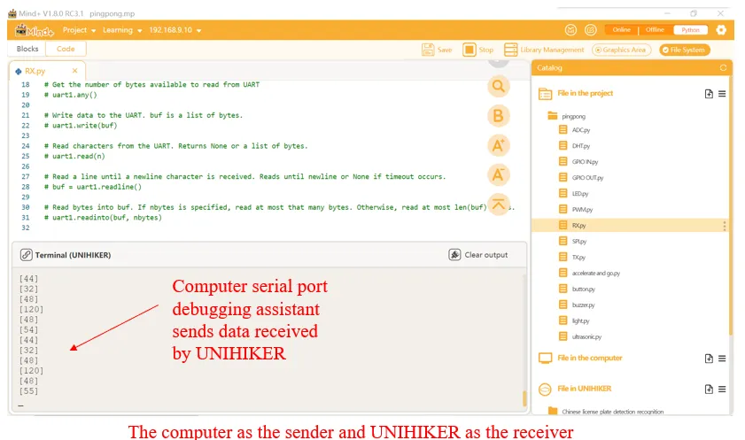
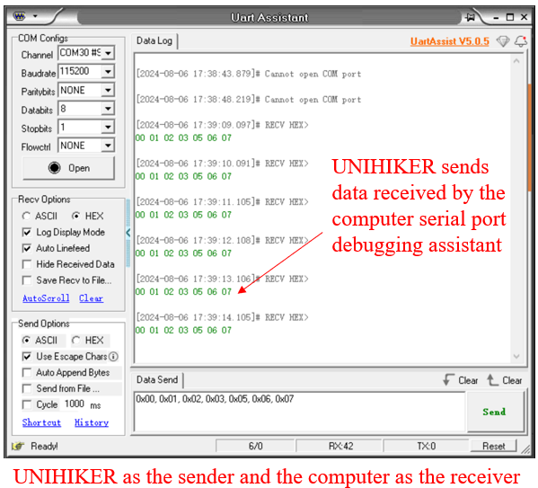

### **Description**
Universal Asynchronous Receiver/Transmitter, commonly known as UART, it is a serial, asynchronous, full duplex communication protocol. UNIHIKER supports UART communication protocol for data transmission through edge connector.
Tips: For more information, please refer to: [https://www.youtube.com/watch?v=vxIjoycPucY](https://www.youtube.com/watch?v=vxIjoycPucY)
### **Common functions**

#### 1.1 UART( )
| **Syntax**          | **Object = UART(bus_num=value)**        | 
| :--------------     | :--------------------      |
| **Description**     | Define the serial port number for the UART serial port.      |  
| **Parameters**      | **bus_num**: UART serial port number.   |  
| **Return**          | **None    |  

#### 1.2 init( )

| **Syntax**          | **Object.init(baud_rate=115200,bits=8,parity=0,stop=1)**        |  
| :--------------     | :--------------------      |
| **Description**     | Initialize UART serial port parameters.      |  
| **Parameters**      | **bus_num:**The default port number chosen by the user is 0.   | 
|                     |  **baud_rate:** Generally, there are options such as 9600, 115200 for selecting baud rate. The actual meaning is to transmit so many bits per second. |
|                     | **bits:** It can be a 5-8 bits logical "0" or "1". Such as ASCI code (7 bits) and extended BCD code (8 bits). Small end transmission.|
|                     | **parity:**After adding this bit to the data, the number of "1" bits should be even (even check) or odd (odd check) to verify the correctness of data transmission.|
|                     | **stop:** It is an end marker for character data. Fixed at high level. |
| **Return**          | **None    |  


#### 1.3 deinit( )
| **Syntax**          | **Object.deinit()**        |  
| :--------------     | :--------------------      |
| **Description**     | Close UART serial port.      |  
| **Parameters**      | **None   | 
| **Return**          | **None    |  


#### 1.4 any( )
| **Syntax**          | **Object.any()**        |  
| :--------------     | :--------------------      |
| **Description**     | Get the number of bytes available to read from UART      |  
| **Parameters**      | **None   | 
| **Return**          | The data read by UART.    |  


#### 1.5 write( )
| **Syntax**          | **Object.write(buf)**        |  
| :--------------     | :--------------------      |
| **Description**     | Write data to the UART.       |  
| **Parameters**      | **buf**: Buf is a list of bytes.   | 
| **Return**          | Write data to the serial port    |  

#### 1.6 read( )
| **Syntax**          | **Object.read(n)**        |  
| :--------------     | :--------------------      |
| **Description**     | Read characters from the UART.       |  
| **Parameters**      | **n:**The number of bytes read from the data.   | 
| **Return**          | Returns None or a list of bytes.    |  


#### 1.7 readline( )
| **Syntax**          | **buf = Object.readline()**        | 
| :--------------     | :--------------------      |
| **Description**     | Read the data received from the serial port by line and put it in the buffer. Reads until newline or None if timeout occurs.       |  
| **Parameters**      | **None   | 
| **Return**          | The data received from the serial port by line and put it in the buffer.    |  


#### 1.8 readinto( )
| **Syntax**          | **Object.readinto(buf, nbytes)**        |  
| :--------------     | :--------------------      |
| **Description**     | Read bytes into buf. If nbytes is specified, read at most that many bytes. Otherwise, read at most len(buf) bytes.       |  
| **Parameters**      | **buf:**Range for reading data.   | 
| **Return**          | Bytes read  into buf.     |  


### **Example Description**
In the following code, we use UART communication protocol for simple data transmission. We use UNIHIKER and a computer as the sending and receiving ends respectively, and perform half duplex data transmission and reception at the same time. The sending and receiving operations on the computer are performed on the serial debugging assistant, while the sending and receiving operations on the line blank board are performed on Mind+.
### **Hardware Required**

- [UNIHIKER](https://www.dfrobot.com/product-2691.html)
- [IO Extender for micro:bit / UNIHIKER](https://www.dfrobot.com/product-1867.html)
- [USB to TTL Converter (CP210)](https://www.dfrobot.com/product-104.html)
- serial debugging assistant( users can download it themselves ）


![0X9P$EGS]WG]SJ35F51DCQO.png](img/1_Serial_Port_UART_/1722936983449-f50884d0-57c0-44cb-a550-27a6afa823fe.png)
### **Example Code**
**Code1:** The first code is UNIHIKER as the receiver and the computer as the sender.
```python
# -*- coding: utf-8 -*-
import time
from pinpong.board import Board, UART

Board("UNIHIKER").begin()  # Initialize the UNIHIKER board. Select the board type, if not specified, it will be automatically detected.

#hardware UART 1 : P0-RX    P3-TX
uart1 = UART(bus_num=0)   # Initialize UART (Hardware Serial 1)

# Initialize UART: `baud_rate` for baud rate, `bits` for the number of data bits (8/9), `parity` for parity check (0 none/1 odd/2 even), `stop` for stop bits (1/2).
uart1.init(baud_rate=115200,bits=8,parity=0,stop=1)  

buf = [0x00, 0x01, 0x02, 0x03, 0x05, 0x06, 0x07]

# The following are common functions of UART #
# Close hardware UART 1
# uart1.deinit() 

# Get the number of bytes available to read from UART
# uart1.any() 

# Write data to the UART. buf is a list of bytes.
# uart1.write(buf)

# Read characters from the UART. Returns None or a list of bytes.
# uart1.read(n)

# Read a line until a newline character is received. Reads until newline or None if timeout occurs.
# buf = uart1.readline()

# Read bytes into buf. If nbytes is specified, read at most that many bytes. Otherwise, read at most len(buf) bytes.
# uart1.readinto(buf, nbytes)

while True:
    while uart1.any() >0:
        print(uart1.read(1))
    time.sleep(1)
```
**Program Effect:**


**Code2: **The second code is UNIHIKER as the sender and the computer as the receiver.
```python
# -*- coding: utf-8 -*-
import time
from pinpong.board import Board, UART

Board("UNIHIKER").begin()  # Initialize the UNIHIKER board. Select the board type, if not specified, it will be automatically detected.

#hardware UART 1 : P0-RX    P3-TX
uart1 = UART(bus_num=0)   # Initialize UART (Hardware Serial 1)

# Initialize UART: `baud_rate` for baud rate, `bits` for the number of data bits (8/9), `parity` for parity check (0 none/1 odd/2 even), `stop` for stop bits (1/2).
uart1.init(baud_rate=115200,bits=8,parity=0,stop=1)  

buf = [0x00, 0x01, 0x02, 0x03, 0x05, 0x06, 0x07]

# The following are common functions of UART #
# Close hardware UART 1
# uart1.deinit() 

# Get the number of bytes available to read from UART
# uart1.any() 

# Write data to the UART. buf is a list of bytes.
# uart1.write(buf)

# Read characters from the UART. Returns None or a list of bytes.
# uart1.read(n)

# Read a line until a newline character is received. Reads until newline or None if timeout occurs.
# buf = uart1.readline()

# Read bytes into buf. If nbytes is specified, read at most that many bytes. Otherwise, read at most len(buf) bytes.
# uart1.readinto(buf, nbytes)

while True:
    uart1.write(buf)  # Write data to UART
    time.sleep(1)
```
**Program Effect:**



---
