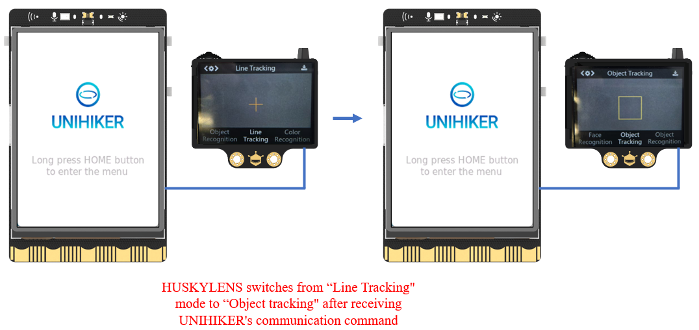

### Description
IIC (Inter Integrated Circuit) bus is a two-wire serial bus developed by NXP (formerly PHILIPS) company, used to connect microcontrollers and their peripheral devices. It is commonly used for master-slave communication between the master controller and slave devices, and is used in small data volume situations with short transmission distance and only one master at any time. Perform bidirectional transmission between the CPU and the controlled IC, as well as between ICs.
IIC has only two buses: one is the bidirectional serial data line SDA, and the other is the serial clock line SCL: 

- SDA (Serial Data) is a data line, D represents Data, and Send Data is used to transmit data.
- SCL (Serial clock line) is the clock line, and C represents Clock, which controls the timing of data transmission.

All serial data SDA connected to I2C bus devices are connected to the SDA of the bus, and the clock lines SCL of each device are connected to the SCL of the bus. Each device on the I2C bus has its own unique address to ensure the accuracy of access between different devices.
Tips: For more information, please refer to: [https://www.youtube.com/watch?v=93RroBDYpr8](https://www.youtube.com/watch?v=93RroBDYpr8)
### Common functions
#### 2.1.**Object = I2C()**
##### Description
Define the initialization function for the I2C.
##### Syntax
**Object = I2C()**
##### Parameters
**None
##### Return
**None
#### 2.2.**Object = I2C(bus_num=value)**
##### Description
Set the port of the I2C.
##### Syntax
**Object = I2C(bus_num=value)**
##### Parameters
**value: **The port number of the I2C.
##### Return
**None
#### 2.3.**Object.writeto(address,data)**
##### Description
Write data to the address.
##### Syntax
**Object.writeto(address,data)**
##### Parameters
**address: **The address where data is written.
**data: **Write data.
##### Return
**None
#### 2.4.**Object.readfrom(address,num)**
##### Description
Read data.
##### Syntax
**Object.readfrom(address,num)**
##### Parameters
**address: **The address for reading data.
**num: **Read the length of the data.
##### Return
The data read.
#### 2.5.**Object.readfrom_mem(address,num1,num2)**
##### Description
Read data from registers.
##### Syntax
**Object.readfrom_mem(address,num1,num2)**
##### Parameters
**address: **The address for reading data.
**num1: **Register number.
**num2: **Read the length of the data.
##### Return
The data read.
#### 2.6.**Object.writeto_mem(address,num,data)**
##### Description
Write data to the register.
##### Syntax
**Object.writeto_mem(address,num,data)**
##### Parameters
**address: **The address for reading data.
**num: **Register number.
**data: **Write data.
##### Return
**None
### Example Description
By utilizing the characteristics of I2C communication, data commands are sent to HUSKYLENS through UNIHIKER, which can control HUSKYLENS to switch recognition modes. After successful switching, HUSKYLENS sends communication data indicating successful mode switching to UNIHIKER. When UNIHIKER receives a data frame starting with "0x55, 0xaa, 0x11", it indicates that the response signal sent by HUSKYLENS has been successfully received by UNIHIKER.
Tips: For more communication instructions, please refer to: [HUSKYLENSArduino/HUSKYLENS Protocol.md at master · HuskyLens/HUSKYLENSArduino · GitHub](https://github.com/HuskyLens/HUSKYLENSArduino/blob/master/HUSKYLENS%20Protocol.md)
### Hardware Required

- [UNIHIKER](https://www.dfrobot.com/product-2691.html) 
- [Gravity: Huskylens - An Easy-to-use AI Camera | Vision Sensor](https://www.dfrobot.com/product-1922.html)


### Example Code
```python
# -*- coding: utf-8 -*-

# Experimental effect: Display of I2C communication protocol control
# Wiring: Connect an I2C slave device to Arduino, assuming I2C address is 0x32
import time
from pinpong.board import Board,I2C

Board("UNIHIKER").begin()

i2c = I2C()
# I2c=I2C (bus_num=0) # bus_num defaults to 0, as Arduino Uno only has one i2c port numbered 0

# i2c.writeto(0x33,[1,2,3,4,5])  # Write [1,2,3,4,5] to i2c device
# i2c.readfrom(0x33,6)  # Read 6 data from i2c device
# i2c.readfrom_mem(0x33,2,6)  # Read 6 data from register 2 of i2c device
# i2c.writeto_mem(0x33,2,[1,2,3,4,5])  # Write [1,2,3,4,5] to register 2 of the i2c device

# Switch algorithm to object tracking. After successful sending, switch algorithm and return COMMAND-RETURN_OK
data_ls=[0x55,0xAA,0x11,0x02,0x2D,0x01,0x00,0x40]  # data

while(1): 
    i2c.writeto(0x32,data_ls)  # Wirte data
    read_data = i2c.readfrom_mem(0x32,0,1)  # Read data
    if read_data is not None and len(read_data) > 0:  # Format the received data
        print(hex(read_data[0]))
        if read_data[0] == 0x55:
            print("a")
            if i2c.readfrom_mem(0x32,0,1)[0] == 0xaa:
                print("b")
                if i2c.readfrom_mem(0x32,0,1)[0] == 0x11:
                    print("c")
                    length = i2c.readfrom_mem(0x32,0,1)[0]
                    print("len=",length)
                    print("len type=",type(length))
                    cmd = hex(i2c.readfrom_mem(0x32,0,1)[0])
                    if not length==0:
                        data = i2c.readfrom_mem(0x32,0,length)
                        print("data=",data)
                        check = hex(i2c.readfrom_mem(0x32,0,1)[0])
                        print(f"{length},{cmd},{check}")
                        print("----------")
    time.sleep(0.5)
```
**Program Effect:**


