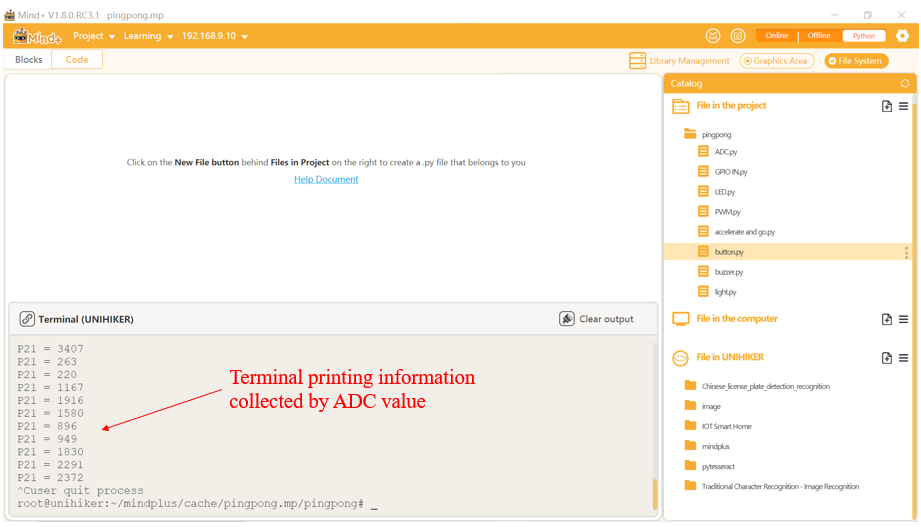

### **Description**
A typical analog-to-digital converter converts an input voltage signal into an output digital signal. UNIHIKER supports 8 channels of 12-bit high-precision analog input ADC, corresponding to the following pins: P0, P1, P2, P3, P4, P10, P21 and P22.
### **Common functions**

#### 1.1 ADC(Pin( ))
| **Syntax**          | **ADC(Pin(Pin.num))**         | 
| :--------------     | :--------------------      |
| **Description**     | Define a pin as an ADC input and read the value through a function.       |  
| **Parameters**      | **Pin.num**: Pin number.                     |  
| **Return**          | Digital quantity converted from analog quantity    |  

#### 1.2 read()
| **Syntax**          | **Object.read()**         |  
| :--------------     | :--------------------      |
| **Description**     | Define a pin as an ADC input and read the value through a function.       |  
| **Parameters**      | **                     |  
| **Return**          | Digital quantity converted from analog quantity    |  


#### 1.3 Pin( )
| **Syntax**          | **Object = Pin(Pin.num, Pin.ANALOG), Object.read_analog()**         |  
| :--------------     | :--------------------      |
| **Description**     | Define a pin as an ADC input and read the value through a function.       |  
| **Parameters**      | **Pin.ANALOG**: Pin initialization to level output. |
| **Return**          | Digital quantity converted from analog quantity    |  

#### 1.4 read_analog( )
| **Syntax**          | **Object = Pin(Pin.num, Pin.ANALOG), Object.read_analog()**         | 
| :--------------     | :--------------------      |
| **Description**     | Define a pin as an ADC input and read the value through a function.       |  
| **Parameters**      | **Pin.ANALOG**: Pin initialization to level output. |
| **Return**          | Digital quantity converted from analog quantity    |  


### **Example Description**
Below is a sample code using the PinPong Library to print the analog value of the UNIHIKER P21 pin.
### **Hardware Required**

- [UNIHIKER](https://www.dfrobot.com/product-2691.html)
### **Example Code**
```python
# -*- coding: UTF-8 -*-
# Experiment Effect: Print the analog value of the UNIHIKER P21 pin
# Wiring: Connect a potentiometer module to the UNIHIKER P21 pin
import time
from unihiker.board import Board, Pin ,ADC

Board().begin()  # Initialize the UNIHIKER
# ADC analog input pins supported: P0 P1 P2 P3 P4 P10 P21 P22
# adc21 = ADC(Pin(Pin.P21))  # Use Pin object with ADC to enable analog input - Method 1
adc21 = Pin(Pin.P21, Pin.ANALOG)  # Initialize the pin as an analog input - Method 2

while True:
    # v = adc21.read()  # Read the analog signal value from pin A0 - Method 1
    v = adc21.read_analog()  # Read the analog signal value from pin A0 - Method 2
    print("P21 =", v)
    time.sleep(0.5)  # Wait for 0.5 seconds
```
**Program Effect:**



---
