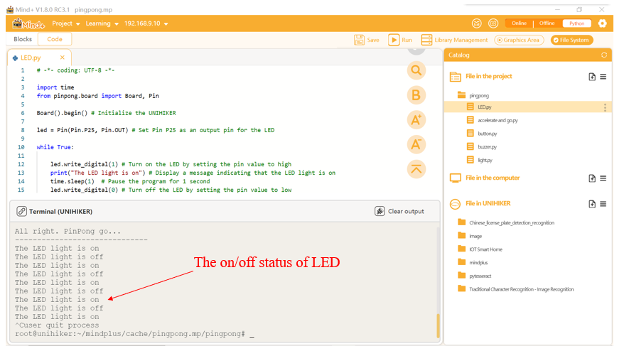

### **Description**
On the back of the UNIHIKER, there is a blue LED light marked "L" that users can control through programming.
The onboard LED labeled as 'L' is connected to the P25 interface of UNIHIKER, meaning that controlling the P25 pin allows for control of the onboard LED.
### **Syntax**
**Pin(Pin.P25, Pin.OUT).write_digital**
### **Parameters**
**Pin.P25:** Pin number 25. 
**Pin.OUT:** Pin output. 
### **Return**
**None
### **Example Description**
Below is a sample code using the PinPong Library to control an LED and print corresponding messages when the LED is turned on or off.
### **Hardware Required**

- [UNIHIKER](https://www.dfrobot.com/product-2691.html)
### **Example Code**
```python
# -*- coding: UTF-8 -*-

import time
from pinpong.board import Board, Pin

Board().begin() # Initialize the UNIHIKER

led = Pin(Pin.P25, Pin.OUT) # Set Pin P25 as an output pin for the LED

while True:
   
    led.write_digital(1) # Turn on the LED by setting the pin value to high
    print("The LED light is on") # Display a message indicating that the LED light is on 
    time.sleep(1)  # Pause the program for 1 second
    led.write_digital(0) # Turn off the LED by setting the pin value to low
    print("The LED light is off")  # Display a message indicating that the LED light is off
    time.sleep(1) # Pause the program for 1 second
```
**Program Effect:**


