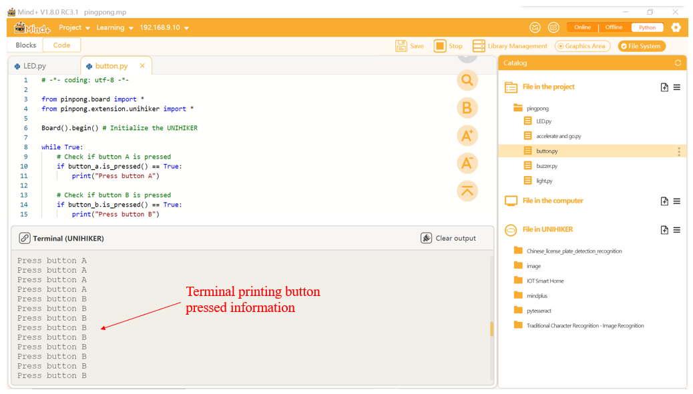

### **Description**
The Pinpong library offers two ways to invoke buttons. The first is the query method, which directly reads the button state or performs related operations. The second is the callback method, which allows the user to define callback functions to handle interrupt events.
Tips: On the UNIHIKER microcontrollers, there are three buttons: Home, A, and B. The Home button is exclusively designated for the homepage menu, while the A and B buttons can be used for user invocation. Additionally, as the A and B buttons are mapped to the AB button on the keyboard, one can also use keyboard events from the UNIHIKER library or other libraries such as Pygame and OpenCV to retrieve keyboard input for invocation.
### **Syntax**
**button_a.is_pressed()**
**button_b.is_pressed()**
### **Parameters**
**None
### **Return**
****When the button is pressed, True is returned; False is returned when the button is not pressed.**
### **Example Description**
Press button A, and the terminal will print "Press button A"; Press button B, the terminal will print "Press button B".
### **Hardware Required**

- [UNIHIKER](https://www.dfrobot.com/product-2691.html)
### **Example Code**
```python
# -*- coding: utf-8 -*-

from pinpong.board import *
from pinpong.extension.unihiker import *

Board().begin() # Initialize the UNIHIKER

while True:
    # Check if button A is pressed
    if button_a.is_pressed() == True: 
        print("Press button A")

    # Check if button B is pressed
    if button_b.is_pressed() == True: 
        print("Press button B")
```
**Program Effect:**



---
