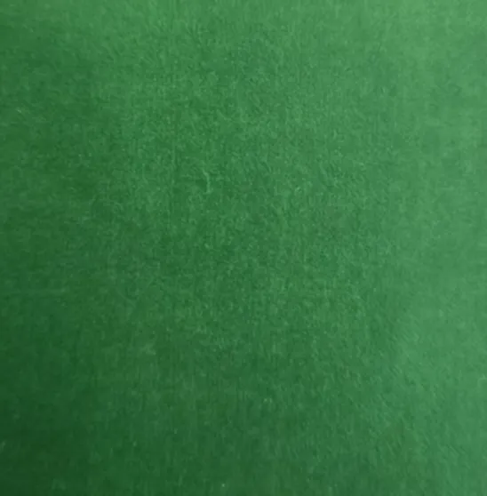
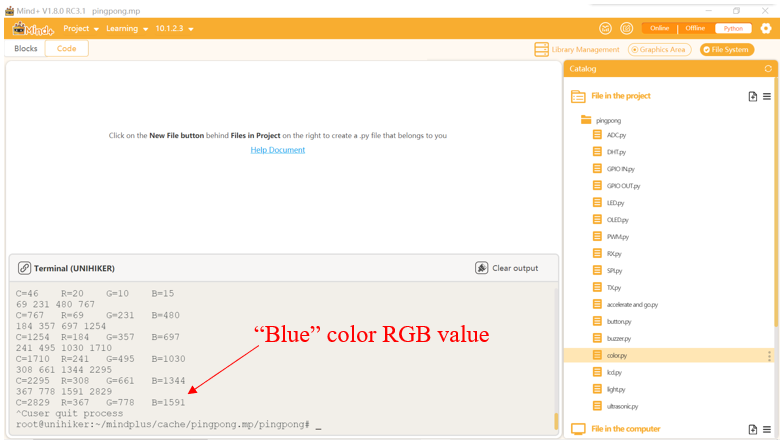

### Description
UNIHIKER is equipped with a microcontroller responsible for controlling onboard components and GPIO. This module uses the control pins of the UNIHIKER to connect a small tool for detecting colors to detect the RGB values of colors. This module uses the control pins of the line blank board to connect a small tool for detecting colors to detect the RGB values of colors. We use color sensors to detect environmental colors, so that the computer terminal displays the corresponding detected color RGB values.
A color sensor is a sensing device that can recognize the color of an object. The sensor emits light on the surface of an object, calculates the color components (red R, green G, blue B) based on the reflected light, and then outputs the RGB values. The sensor is equipped with four high brightness LEDs around it, allowing it to function normally even in low ambient light conditions.
Tips: When in use, connect the color sensor to the IIC interface. When taking colors, be sure to place the color sensor 3-10mm above the object.
### Common functions
#### 6.1.**Object = TCS34725()**
##### Description
Define the initialization function for the color sensor.
##### Syntax
**Object = TCS34725()**
##### Parameters
**None
##### Return
**None
#### 6.2.Object.begin()
##### Description
Turn on the color sensor.
##### Syntax
**Object.begin()**
##### Parameters
**None
##### Return
**None
#### 6.3.**r,g,b,c = Object.get_rgbc()**
##### Description
Obtain the detected color parameter values.
##### Syntax
**r,g,b,c = Object.get_rgbc()**
##### Parameters
**r: **Red color value.
**g: **Green color value.
**b: **Blue color value.
**c: **Filter out the original infrared light.
##### Return
Detected values of r, g, and b.
### Example Description
Firstly, we import the Pinpong library color sensor module to supplement the initialization of the UNIHIKER and create color sensor objects. Then, we initialize the color sensor and apply a judgment statement to confirm if the connection is successful. Finally, we obtain the values of r, g, b, and c through color sensors in the loop so that we can print and obtain color values in real time. Finally, we use r,g,b,c = tcs.get_rgbc() obtain the values of r, g, b, and c through color sensors in the loop so that we can print and obtain color values in real time.
### Hardware Required

- [UNIHIKER](https://www.dfrobot.com/product-2691.html)
- [Gravity: TCS34725 RGB Color Sensor For Arduino](https://www.dfrobot.com/product-1546.html)


### Example Code
```python
# -*- coding: UTF-8 -*-

# Experimental effect: Reading the value of I2C TCS34725 color sensor

import time
from pinpong.board import Board
from pinpong.libs.dfrobot_tcs34725 import TCS34725  # Import tcs34725 library from libs

Board("uno").begin()  # Initialize, select board type and port number, automatically recognize without entering port number

tcs = TCS34725()  # Sensor initialization

print("Color View Test!");
while True:
  if tcs.begin():  # Search for sensors and return True if detected
    print("Found sensor")
    break  # Find it, jump out of the loop
  else:
    print("No TCS34725 found ... check your connections")
    time.sleep(1)

while True:
  r,g,b,c = tcs.get_rgbc()  # Obtain RGBC data
  print(r,g,b,c)
  print("C=%d\tR=%d\tG=%d\tB=%d\t"%(c,r,g,b))

  '''
  # Data conversion, quantifying the monitored RGB values.
  r /= c
  g /= c
  b /= c
  r *= 256
  g *= 256
  b *= 256;
  print("------C=%d\tR=%d\tG=%d\tB=%d\t"%(c,r,g,b))
  '''
  time.sleep(1)
```
**Program Effect:**



