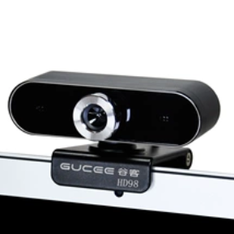
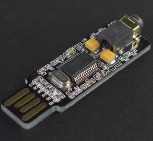
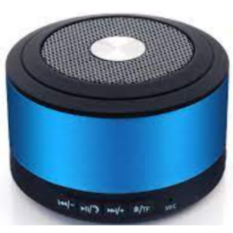

# 1. AI Application
UNIHIKER runs the debian system, with a 1.2GHz CPU and 512MB DDR3, and can run full Python 3, so it can run some Python AI applications.
Note: The line blank board does not have AI acceleration function, so complex applications that require high computing power may not run smoothly.
# 2. Pre knowledge learning instructions
The use of AI projects requires a certain foundation. Please make sure to complete the following prerequisite knowledge before experiencing the subsequent projects in this article.

- [Instructions for getting started with UNIHIKER](https://www.yuque.com/joanna-rqvih/unihiker_wiki_en/skrays280uk2ppkn)
- [The UNIHIKER cannot be connected to Mind+](https://www.yuque.com/joanna-rqvih/unihiker_wiki_en/sstfwqgttyxcvn2y)
- [How can I get the Mind+ graphical program to run on the UNIHIKER after disconnecting it from my computer?](https://www.yuque.com/joanna-rqvih/unihiker_wiki_en/bbw5ib6747uwhwwd)
- [How to connect WIFI?](https://www.yuque.com/joanna-rqvih/unihiker_wiki_en/yz6fvwxqkngefeyx)
- [What should I do if there is an error during operation?](https://www.yuque.com/joanna-rqvih/unihiker_wiki_en/kawm3o63qhwsxbc2)
# 3- External Hardware Description
There is no onboard camera on UNIHIKER, so when running applications that require a camera, a regular non drive USB camera can be connected to the USB A port of the board.

|  |  |
| --- | --- |
| [0.3 MegaPixels USB Camera for Raspberry Pi / NVIDIA Jetson Nano / UNIHIKER](https://www.dfrobot.com/product-2089.html) | USB carema for free driv |

The microphone is mounted on UNIHIKER, so there is no need for external devices for speech recognition cases.

There are no speakers on UNIHIKER, so when doing voice synthesis or speech, it is necessary to connect a USB speaker or USB to 3.5mm adapter board, or it can be connected to a Bluetooth speaker for use.

|  |  |  |
| --- | --- | --- |
| [Mini USB External Sound Card for NVIDIA Jetson Nano/ Raspberry Pi 400 / UNIHIKER](https://www.dfrobot.com/product-2545.html) | USB Speaker for free drive | Bluetooth audio |

UNIHIKER has a USB 2.0 interface, and if multiple USB peripherals need to be connected, they can be expanded through a USB docking station.
Attention: If there are many USB peripherals, an additional power supply dock is needed to add an independent power supply to the dock, such as the one shown in the following figure:

|  |  |
| --- | --- |
| USB 2.0 docking station with power supply port | USB docking station with Ethernet port and power supply port |

# 4-AI Projects

- [Ai-Smart Electronics Recognition](https://community.dfrobot.com/makelog-313531.html)
- [Ancient Poetry Classification Using MultinomialNB on UNIHIKER](https://community.dfrobot.com/projects-AI.html)
- [Traditional Character Recognition using Pytesseract on UNIHIKER](https://community.dfrobot.com/makelog-314464.html)
- [Traffic Light Detection system](https://community.dfrobot.com/makelog-313531.html)
- [Object Classification Project Using ShuffleNetV2 Based on UNIHIKER](https://community.dfrobot.com/makelog-314376.html)
- [QR Code Detection Using OpenCV Based on UNIHIKER](https://community.dfrobot.com/makelog-314359.html)
- [Edge Detection Using OpenCV on UNIHIKER](https://community.dfrobot.com/makelog-314358.html)
- [OpenCV Feature Homography Target Tracking Using UNIHIKER](https://community.dfrobot.com/makelog-314340.html)
- [OpenCV LK Homography Target Tracking Using UNIHIKER](https://community.dfrobot.com/makelog-314341.html)
- [Object Classification Project Using NanoDet on UNIHIKER](https://community.dfrobot.com/makelog-314356.html)
- [OpenCV lk_track Target Tracking based on UNIHIKER](https://community.dfrobot.com/makelog-314296.html)
- [OpenCV Square Detection based on UNIHIKER](https://community.dfrobot.com/makelog-314281.html)
- [Mediapipe Face Detection Facial Mesh Drawing Based on UNIHIKER](https://community.dfrobot.com/makelog-314255.html)
- [Gesture recognition and tracking ｜ Mediapipe Hands x UNIHIKER](https://community.dfrobot.com/makelog-314261.html)
- [Human Segmentation from Image ｜ Mediapipe Selfie Segmentation Model x UNIHIKER](https://community.dfrobot.com/makelog-314259.html)
- [Real-Time Background Replacement on UNIHIKER with MediaPipe and OpenCV](https://community.dfrobot.com/makelog-314239.html)
- [Smart Hearing Aid: AI-Powered Technology Using UNIHIKER](https://community.dfrobot.com/makelog-314253.html)
- [Facial Landmark Detection and Drawing | with OpenCV & UNIHIKER](https://community.dfrobot.com/makelog-314246.html)
- [Facial Beauty Evaluation with Computer Vision: Chinese Golden Ratio Face](https://community.dfrobot.com/makelog-314225.html)
- [Yolo LPR (License Plate Recognition) Device Based on UNIHIKER](https://community.dfrobot.com/makelog-314231.html)
- [[UNIHIKER+ChatGPT] Empowering Smart Home Automation with SBC (Single Board Computer) and LLM](https://community.dfrobot.com/makelog-313989.html)
- [Building an AI Assistant on Unihiker Single Board Computer with ChatGPT API and Azure Speech API](https://community.dfrobot.com/makelog-313685.html)
- [How to Make a Fruit Classification Project with UNIHIKER](https://community.dfrobot.com/makelog-313295.html)
