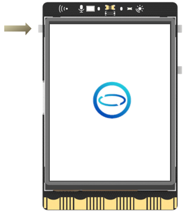
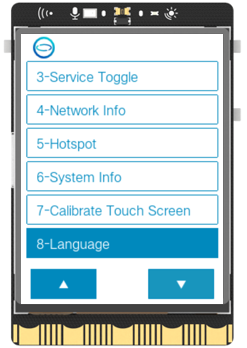
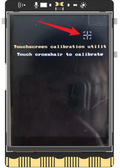

To make navigation easier, the UNIHIKER has a HOME menu that can be accessed by long-pressing the Home button or long-pressing the TouchScreen. Use button A and B to move the cursor up and down, and press the Home button to confirm your selection.
{style="display:block;margin: 0 auto"}  
  
The Home menu on the UNIHIKER allows for convenient access to commonly used features for controlling the board, including:

- Switching between running programs
- Service Toggle
- Viewing network information
- Enabling/disabling hotspot mode
- Calibrate Touch Screen
- Change Language

 
  
## 1-Run Programs
This option displays all Python programs located in the system file directory. Selecting a program and pressing the Home button will start running it. To exit a running program, simply press and hold the Home button.

## 2-Service Toggle
This menu provides access to the built-in applications and their respective controls:

- Jupyter: The Jupyter Python editor service can be turned on or off using this menu. By default, it is turned off.
- SIoT: The SIoT IoT server can be turned on or off using this menu. By default, it is turned on.
- File sharing: Samba file sharing can be turned on or off using this menu. By default, it is turned on.
- Screen sharing: VNC screen sharing can be turned on or off using this menu. By default, it is turned on.
- Auto boot: This menu also allows for the automatic running of the last program that was used before shutdown. By default, this function is turned off.

Note: If the program set to automatically start on boot is deleted, an error message such as "python3: cannot open xxxx.py" or "python3: can't open file '/root/xxx':[Errno 2] No such file or directory" will be displayed upon boot. To resolve this issue, simply run any other program from the Run Programs menu or turn off the autostart feature.  
{style="display:block;margin: 0 auto"}

## 3-Network Info
This menu option allows users to check the network IP address:

- USB Ethernet: When connected to a computer via USB, the board's IP address will be displayed and fixed at 10.1.2.3.
- Wireless Connection: When connected to other WiFi hotspots, the board's IP address assigned by the router will be displayed.
- Wireless Hotspot: When the UNIHIKER is in wireless hotspot mode, the board's IP address will be displayed and fixed at 192.168.123.1.
- Other Devices: When connected to other network devices, such as a network card, the board's IP address assigned by the router will be displayed.

{style="display:block;margin: 0 auto"}

## 4-Hotspot
{style="display:block;margin: 0 auto"}  
This menu option allows for the turning on or off of the wireless hotspot on the UNIHIKER board. When turned on, the SSID and password will be displayed on the screen, and other devices can search for and connect to this hotspot.
**Note**: Please keep in mind that the UNIHIKER is not connected to the Internet, so it can only be used for local area network (LAN) purposes. This means that when other devices connect to its hotspot, they will lose Internet connectivity, and the only accessible IP address will be 192.168.123.1.


## 5-System Info
System-related information can be found in this menu.

- System Version: The current system version will be displayed in this menu.
- CPU Usage: The current CPU usage will be displayed in this menu.
- Memory Usage: The current memory usage will be displayed in this menu.
- Disk Usage: The current disk usage will be displayed in this menu.

{style="display:block;margin: 0 auto"}

## 6-Calibrate Touch Screen
If you experience inaccurate touch response on the UNIHIKER screen, you can recalibrate it. Simply click on "Calibrate Touch Screen" and the screen will display five calibration points one by one. Use your fingernail to tap each of the five points in sequence, and the system will restart once the calibration is complete.  
  
{width=250}{width=250}{width=250}

## 7- Language
This interface displays the available system languages that can be switched. Once confirmed with the Home button, the UNIHIKER will restart and the language switch will take effect. Please note that the language switch option will always appear as the last item on the Home menu. If you accidentally switch to another language, simply access the Home menu and select the last item to open this interface.
Currently, there are two language options available - Chinese and English. If you would like to translate into another language, you can add a .json file for that language in the /opt/unihiker/pyboardUI/locale/ directory. For example, if you want to add French (fr.json), place the file here and modify the value corresponding to the key in the json file (do not modify the key itself). This menu will automatically read the language files within the folder and display them in this list for you to choose from.  
{style="display:block;margin: 0 auto"}  

## 8- Enable/disable the HOME menu
The HOME menu runs as a service and can be stopped using this menu.
Note: Please only use this option if necessary.
```bash
systemctl --user start PyboardUI  #enable 
systemctl --user stop PyboardUI  #disable 
systemctl --user restart PyboardUI  #restart
```
