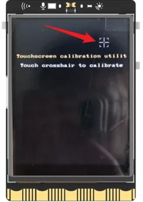

If you need to update your UNIHIKER system to the latest version or restore a malfunctioning system, you can follow these steps to flash a new OS. Please note that the UNIHIKER comes with a Linux operating system based on Debian and various built-in features, which may be updated periodically.

## **1- File Backup**

- Before re-flashing the OS image, please note that all files on the UNIHIKER, including those in the root directory, will be cleared and cannot be restored. We recommend backing up any necessary files before proceeding with the firmware flashing process.
- To save personal files from the root directory before flashing the OS, you can use the SMB function to copy them to your computer. After the OS is refreshed, you can copy the files back to the UNIHIKER. Please note that hidden files will not be copied.

## **1- OS Image Download**

### **3- Initial Setup**

- 1.On the language selection screen, you can use the AB buttons to move the cursor up and down, and the Home button to confirm your selection. After making your selection, the UNIHIKER will reboot.

If you accidentally select the wrong language, you can reselect your desired language from the [Home Menu](https://www.unihiker.com/wiki/homemenu).  

- 2.After selecting your language, the UNIHIKER logo will appear. Press the HOME button to enter the HOME menu. Use the A and B buttons to move the cursor up and down, and use the HOME button to confirm. Select "Enter" to check the system information and make sure that the system version matches the version of the system image that was just installed. If it does, then the system image has been successfully burned.

- 3.After flashing the system, the touch screen will need to be re-calibrated before use. To do this, select "Calibrate touch screen" in the HOME menu. The screen will display five touch points in sequence. Click on each touch point, and the system will restart to complete the calibration process.

